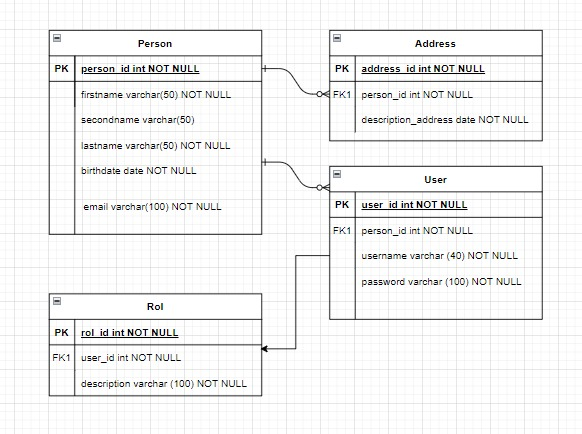

# Modelo Entidad Relacion Persona

## Objetivo 

Este proyecto se realiza con el fin de representar un modelo entidad relacion, de una persona donde se evidencia como se relacionan las tablas hijas con las padres y se le podria asociar un usuario a un sistema que se pueda implementar a futuro.

## Representación

Sino es posible verlo en el siguiente recuadro pueden observarlo en la carpeta resources/MER_PERSONA.jpg

### Muchas gracias

